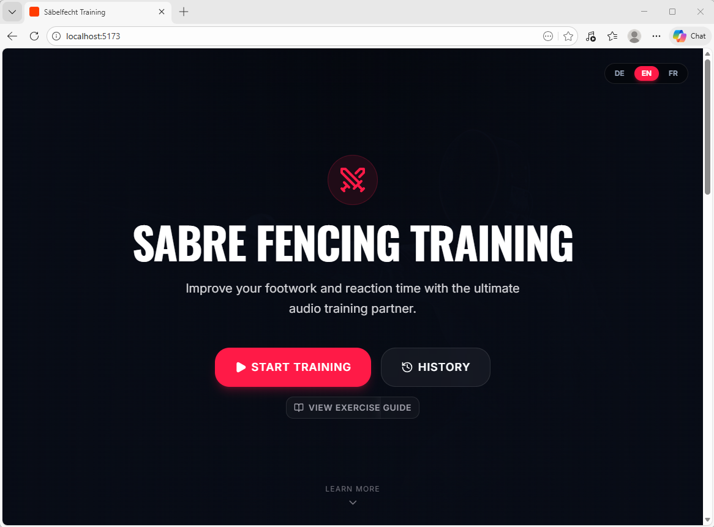
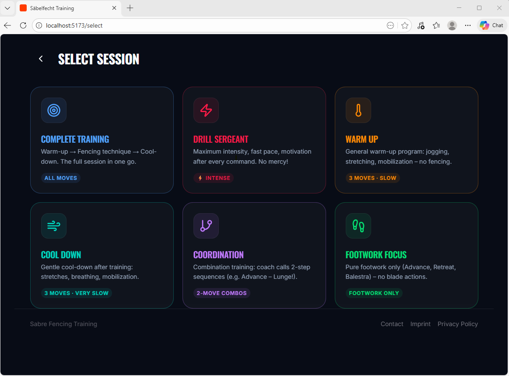
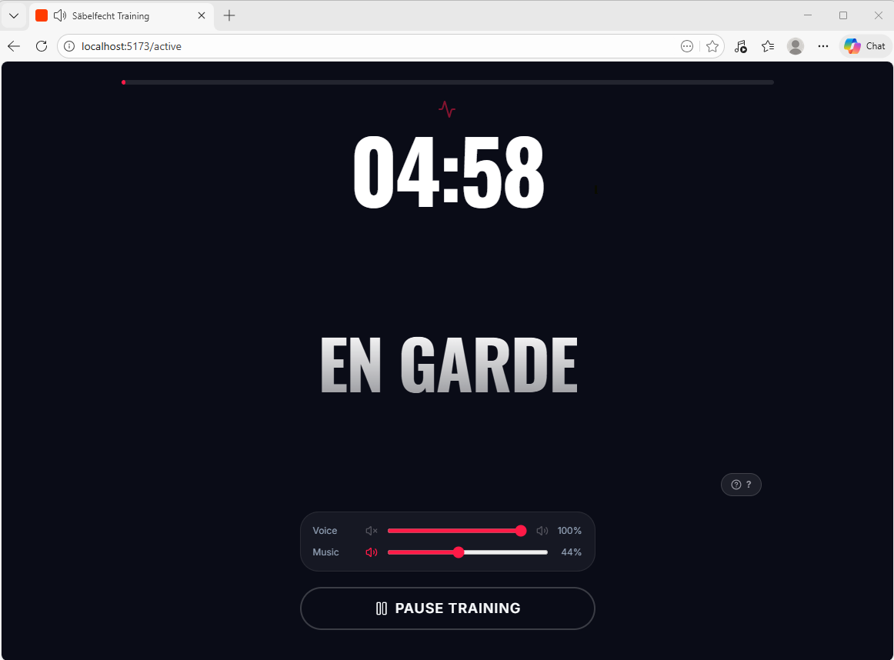
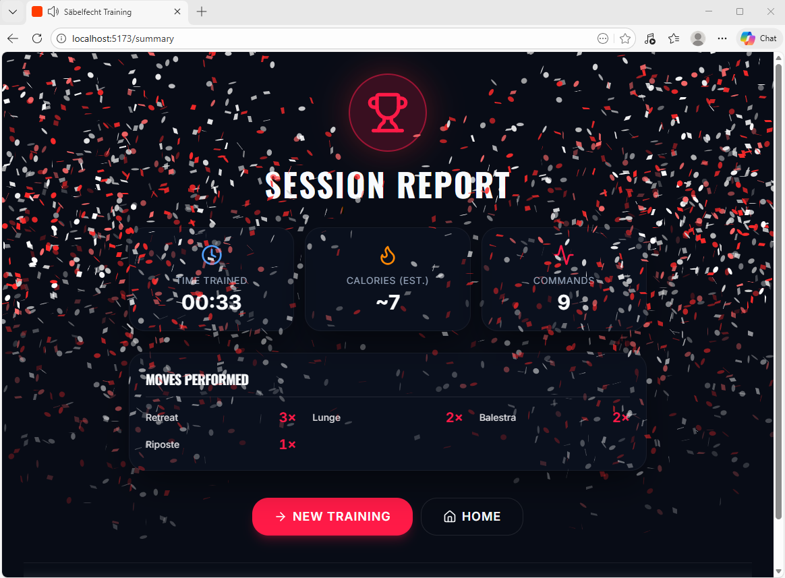

# Sabre Command Trainer

Sabre Command Trainer is a browser-based training app for sabre fencers who want a fast, structured way to practice footwork, reactions, and command-based drills. It combines a focused athletic UI with spoken commands, adjustable drill settings, local session history, and a lightweight API for selected server-side features.

The project is built as a pnpm workspace monorepo with a React/Vite frontend and an Express backend. The training flow is designed to work well for solo practice sessions, from warm-up to active drills and final session review.

## Live Website

[https://sabrecommandtrainer.com](https://sabrecommandtrainer.com)

## Repository

`JanoschA/sabrecommandtrainer`

## Features

- Multiple training modes, including complete training, drill, warm-up, cool-down, coordination, and footwork focus
- Spoken commands during active sessions
- Adjustable timing, move selection, and audio settings
- Local session history stored in the browser
- English, German, and French language support
- Session summary with quick performance feedback

## Screenshots

### Home Page



### Training Session Selection



### Active Training



### Session Summary



## Repository Structure

```text
artifacts/
  api-server/        Express backend
  sabre-training/    React + Vite frontend
lib/
  api-client-react/  Generated React API client
  api-spec/          OpenAPI definition
  api-zod/           Generated Zod schemas
scripts/             Workspace utility scripts
```

## Run Locally

### Prerequisites

- Node.js 24
- pnpm 10 or newer

Install dependencies from the repository root:

```bash
pnpm install
```

### Linux

Start the backend in one terminal:

```bash
cd /path/to/sabrecommandtrainer
export PORT=8080
export CONTACT_EMAIL="your@email.com"
export SMTP_HOST="your.smtp.host"
export SMTP_PORT="587"
export SMTP_USER="your-smtp-user"
export SMTP_PASS="your-smtp-password"
export TURNSTILE_SITE_KEY="1x00000000000000000000AA"
export TURNSTILE_SECRET_KEY="1x0000000000000000000000000000000AA"
pnpm --filter @workspace/api-server run build
pnpm --filter @workspace/api-server run start
```

Start the frontend in a second terminal:

```bash
cd /path/to/sabrecommandtrainer
export PORT=21212
export BASE_PATH=/
export API_PROXY_TARGET=http://localhost:8080
pnpm --filter @workspace/sabre-training run dev
```

The frontend will be available at:

[http://localhost:21212](http://localhost:21212)

### Windows (PowerShell)

Start the backend in one PowerShell window:

```powershell
Set-Location C:\path\to\sabrecommandtrainer
$env:PORT="8080"
$env:CONTACT_EMAIL="your@email.com"
$env:SMTP_HOST="your.smtp.host"
$env:SMTP_PORT="587"
$env:SMTP_USER="your-smtp-user"
$env:SMTP_PASS="your-smtp-password"
$env:TURNSTILE_SITE_KEY="1x00000000000000000000AA"
$env:TURNSTILE_SECRET_KEY="1x0000000000000000000000000000000AA"
pnpm --filter @workspace/api-server run build
pnpm --filter @workspace/api-server run start
```

Start the frontend in a second PowerShell window:

```powershell
Set-Location C:\path\to\sabrecommandtrainer
$env:PORT="21212"
$env:BASE_PATH="/"
$env:API_PROXY_TARGET="http://localhost:8080"
pnpm --filter @workspace/sabre-training run dev
```

The frontend will be available at:

[http://localhost:21212](http://localhost:21212)

### Notes for Local Development

- For most UI work, the frontend alone is enough.
- The backend is mainly used for server-side API routes such as health checks and contact form handling.
- `API_PROXY_TARGET` is used only for local Vite development so the frontend can forward `/api` requests to your backend.
- In production, the frontend expects API routes under `/api` on the same origin.
- The contact form only works when the backend is running and valid SMTP plus Cloudflare Turnstile credentials are configured.
- The Turnstile keys above are Cloudflare's official test keys for local development. Replace them with your real widget keys before going live.

## Batch Voice Generation

Existing localized move labels can be turned into MP3 files in one run via the ElevenLabs API.

Set your API key and one voice ID per language:

```bash
export ELEVENLABS_API_KEY="your-api-key"
export ELEVENLABS_VOICE_ID_EN="your-english-voice-id"
export ELEVENLABS_VOICE_ID_FR="your-french-voice-id"
```

Then generate missing audio files:

```bash
pnpm --filter @workspace/scripts run generate:audio -- --langs en,fr
```

Useful options:

- `--overwrite` regenerates files that already exist
- `--dry-run` prints the planned output without calling the API
- `--categories training,warmup,cooldown,motivation` limits the batch to selected groups
- Training commands are generated with expressive prompt tags by default, so `eleven_v3` is the recommended model for this workflow

## Tech Stack

- React
- Vite
- TypeScript
- Tailwind CSS
- shadcn/ui
- Zustand
- Wouter
- Framer Motion
- Express
- OpenAPI + generated client/schema packages

## Deployment

For a minimal AWS setup, the repository includes a Lightsail deployment path with:

- a single Docker image for frontend + API
- a Caddy reverse proxy for automatic HTTPS
- a Lightsail bootstrap file
- a GitHub Actions workflow that builds the image on GitHub, pushes it to GHCR, and redeploys on pushes to `master`

Recommended first-time setup:

1. Create a small Ubuntu Lightsail instance
2. Open at least ports `22`, `80`, and `443` in the Lightsail firewall
3. Point your production domain to the instance's static IP
4. SSH into the server and install Docker manually once:

```bash
sudo apt-get update
sudo apt-get install -y ca-certificates curl gnupg
sudo install -m 0755 -d /etc/apt/keyrings
curl -fsSL https://download.docker.com/linux/ubuntu/gpg | sudo gpg --dearmor -o /etc/apt/keyrings/docker.gpg
sudo chmod a+r /etc/apt/keyrings/docker.gpg
echo "deb [arch=$(dpkg --print-architecture) signed-by=/etc/apt/keyrings/docker.gpg] https://download.docker.com/linux/ubuntu $(. /etc/os-release && echo $VERSION_CODENAME) stable" | sudo tee /etc/apt/sources.list.d/docker.list > /dev/null
sudo apt-get update
sudo apt-get install -y docker-ce docker-ce-cli containerd.io docker-buildx-plugin docker-compose-plugin
sudo systemctl enable docker
sudo systemctl start docker
sudo usermod -aG docker ubuntu
sudo mkdir -p /opt/fechttrainer/app
sudo chown -R ubuntu:ubuntu /opt/fechttrainer
```

5. Reconnect once and verify:

```bash
docker --version
docker compose version
```

6. Add the required GitHub repository secrets
7. Push to `master` to trigger the deploy workflow

For GHCR access, create a GitHub personal access token (classic) with `read:packages`, store it as `GHCR_TOKEN`, and store your GitHub username as `GHCR_USERNAME`.

The Lightsail deployment now uses Caddy for HTTPS. The checked-in Caddy config currently expects:

- `sabrecommandtrainer.com`
- `www.sabrecommandtrainer.com`

If you later change the production domain, update [deploy/aws/lightsail/Caddyfile](deploy/aws/lightsail/Caddyfile) and redeploy.

For the full Lightsail notes, including secrets and optional `cloud-init`, see [deploy/aws/lightsail/README.md](deploy/aws/lightsail/README.md).

## License

The source code in this repository is licensed under the MIT License. See [LICENSE](LICENSE).

All non-code content remains copyright of Janosch Adams and is not covered by the MIT License unless explicitly stated otherwise. This includes project text, screenshots, images, graphics, audio files, branding, and other media assets. See [CONTENT-LICENSE.md](CONTENT-LICENSE.md).
